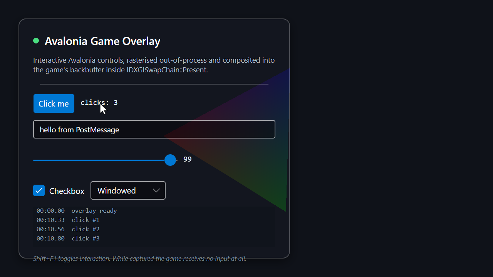

# Avalonia Game Overlay

A library for rendering **interactive Avalonia controls on top of a running game** including games
in **exclusive fullscreen**, across **Direct3D 11, Direct3D 12, Vulkan and OpenGL** while imposing a
measured **~0.02 ms per frame** on the game.



*Real Avalonia Fluent controls composited into a D3D11 game's backbuffer, in exclusive fullscreen.
The button has been clicked, text typed and the slider dragged, all driven through the game's own
window while the game itself received no input at all. The overlay is not a window.*

---

## Using the library

`GameOverlay.Avalonia` is a class library that any Avalonia application can reference to project its
own controls onto a game. It runs **inside your Avalonia app** hosting your control on the app's UI
thread so you call it from an initialised Avalonia application (a second `AppBuilder` per process is
not possible). The native payload ships in the package under `runtimes/win-x64/native` (with the 32-bit payload for WoW64 games in the `x86/` subfolder alongside it).

```csharp
using GameOverlay.Avalonia;

// From within a running Avalonia app (on/with access to its UI thread):
var overlay = GameOverlay.AttachToProcess("MyGame");   // or AttachToProcess(pid) / Launch(exePath)
overlay.Content = new MyOverlayView();                 // any Avalonia Control tree

// Shift+F1 (default) toggles interaction; or drive it yourself:
overlay.Interactive = true;                            // capture input; the game receives none

overlay.Attached  += (_, _) => Console.WriteLine($"live on {overlay.GraphicsApi}");
overlay.GameExited += (_, _) => overlay.Dispose();
```

Notes:

- **`Launch(exePath)` is required for Vulkan** — its device extensions can only be added at creation
  time, so the payload must be injected before the game starts. D3D11/D3D12/OpenGL can
  `AttachToProcess` a running game.
- **`Content` is a `Control`, not a `Window`** (a window is itself a top-level and cannot be
  embedded). Pass a control tree — for example your window's content, or a purpose-built overlay view.
- Configure via `GameOverlayOptions` (`Scaling`, `TargetFps`, `ToggleHotkey`, `StartInteractive`,
  `PayloadPath`, `DiagnosticLog`).
- The overlay draws **its own cursor** — you do not add one.
- An overlay-only app (no visible window) simply initialises a minimal Avalonia app first; see
  `src/GameOverlay.Avalonia.Sample/Program.cs`.

In exclusive fullscreen the game's swapchain is scanned out directly and DWM is bypassed. **No
window (however transparent, topmost or layered) can appear over it.** Avalonia does **not** run in the game process. It renders in a separate host process into a shared GPU texture, and the injected payload does nothing but composite one textured quad.

```
┌─ Host process (C#, .NET 10, Avalonia 11.3.12) ───────────┐
│  EmbeddableControlRoot                                    │
│    └─ OverlayTopLevelImpl : OffscreenTopLevelImplBase     │
│         └─ SharedTextureFramebufferSurface                │
│              Skia rasterises into a pinned BGRA buffer    │
│                        │ memcpy                           │
│              D3D11 DYNAMIC upload texture                 │
│                        │ CopyResource                     │
│              D3D11 SHARED texture (NT handle + keyed ─────┼──┐
│                                    mutex)                 │  │
│  InputRouter ◄── drains input ring ◄───────────────────┐  │  │
│  Injector: CreateRemoteThread(LoadLibraryW)            │  │  │
└────────────────────────────────────────────────────────┼──┘  │ shared
                                                         │     │ GPU
┌─ Game process ──────────────────────────────────────┐  │     │ texture
│  GameOverlay.Native.dll  (C++, no CLR, no allocs)   │◄─┼─────┘
│    MinHook → Present / Present1 / ResizeBuffers     │  │
│    per frame: TryAcquire(0 ms) → copy → 3-vert draw │  │
│    WndProc subclass → swallow input ────────────────┼──┘
└─────────────────────────────────────────────────────┘
```

All the expense lives in the host. The game pays for one keyed-mutex try-acquire, one conditional
copy, a pipeline state save/restore, and one `Draw(3, 0)`.

## Interaction

Press **Shift+F1** to take input. While captured the overlay receives every mouse and keyboard
event and the game receives none; press it again to give input back.

The hotkey is customizable. Set `GameOverlayOptions.ToggleHotkey` to any `OverlayHotkey`
(`new OverlayHotkey(Key.Tab, KeyModifiers.Alt)`), pass `null` to install no hotkey and drive
`GameOverlay.Interactive` yourself, or rebind it at runtime through the settable
`GameOverlay.ToggleHotkey` property (for example from a settings screen).

Input is intercepted by **subclassing the game's window procedure** in the payload rather than with a
host-side low-level hook. That is not a stylistic choice: `WH_MOUSE_LL` cannot reliably suppress
`WM_INPUT`, and modern games read mouse-look through Raw Input, so a low-level hook would leave the
player's camera spinning while they used the overlay. `WM_INPUT` is an ordinary window message, so a
subclass can swallow it — and read the deltas on the way past.

The **cursor is drawn inside the Avalonia visual tree** and its position is owned by the host, fed by
absolute `WM_MOUSEMOVE` coordinates or Raw Input deltas. This is functional rather than decorative: a
game holding the pointer clipped to screen centre for mouse-look has no useful OS cursor position,
and in exclusive fullscreen there is usually no visible system cursor at all.

## Status

| Capability | State |
|---|---|
| D3D11 — windowed / borderless / **exclusive fullscreen** | ✅ verified (incl. 720p→4K resize) |
| **D3D12** — windowed / borderless / **exclusive fullscreen** | ✅ verified |
| **Vulkan** — windowed / borderless / **exclusive fullscreen** | ✅ verified |
| **OpenGL** — windowed / borderless / **exclusive fullscreen** | ✅ verified |
| Live Avalonia controls, themes, animation | ✅ verified |
| **Interaction** — click, type, drag, scroll | ✅ verified in all three modes |
| Input suppression to the game while captured | ✅ verified (incl. Raw Input) |
| Hotkey show/hide, clean detach, host-crash resilience | ✅ verified |
| Gamepad / DirectInput, touch | ❌ not handled (see *Not done*) |

## Build and run

Requires Windows x64, the .NET 10 SDK, CMake, and MSVC (VS 2022 Build Tools) with the Windows SDK.

```powershell
./build.ps1
```

Then, against the bundled test game:

```powershell
# start a sample game, attach the overlay, switch to exclusive fullscreen, screenshot
./tools/capture-overlay.ps1 -Mode exclusive -KeepAlive

# click, type and drag the overlay's controls, then assert the game saw nothing
./tools/interact-overlay.ps1 -Mode exclusive

# measure what the overlay costs the game
./tools/measure-overlay.ps1
```

Every tool takes `-Api d3d11` (default), `-Api d3d12` or `-Api vulkan` to pick which sample renderer
to overlay. Vulkan is launched suspended by the host automatically (see below), so the tools handle
it transparently:

```powershell
./tools/interact-overlay.ps1 -Api vulkan -Mode exclusive
./tools/measure-overlay.ps1  -Api d3d12
```

Or drive it manually:

```powershell
./build/bin/SampleGame.exe                                     # F1/F2/F3 switch display mode
./src/.../GameOverlay.Avalonia.Sample.exe --name SampleGame    # Shift+F1 toggles, Ctrl+C detaches
```

Sample CLI options: `--pid` / `--name` / `--launch`, `--test-pattern` (dependency-free pattern
instead of Avalonia, for isolating transport problems from UI problems), `--launch-args`, `--fps`,
`--payload`.

> Windows can refuse `SetFullscreenState` — if another application holds exclusive mode, or the
> window is not genuinely foreground. `SampleGame` then falls back to borderless and says
> `(exclusive REFUSED)` in its title bar rather than failing loudly, so re-run the capture if you see
> that. It is an environment condition, not an overlay failure.

## Measured cost

A/B/A measurement (baseline → attached → host killed) against `SampleGame` with vsync off, so the
per-frame cost is not hidden inside a wait for the display refresh:

```
D3D11                        Fps    AvgMs  P50Ms  P99Ms
baseline (no overlay)      13110    0.077  0.058  0.640
overlay attached           10894    0.093  0.058  0.666
host killed (payload idle) 13874    0.074  0.054  0.717
                             ->  avg +0.016 ms

D3D12                        Fps    AvgMs  P50Ms  P99Ms
baseline (no overlay)       8775    0.115  0.070  1.110
overlay attached            7104    0.141  0.095  1.000
host killed (payload idle)  8708    0.119  0.075  1.030
                             ->  avg +0.026 ms

Vulkan                       Fps    AvgMs  P50Ms  P99Ms
baseline (no overlay)      12944    0.078  0.060  0.400
overlay attached           12235    0.082  0.062  0.410
host killed (payload idle) 12109    0.078  0.060  0.410
                             ->  avg +0.004 ms

OpenGL                       Fps    AvgMs  P50Ms  P99Ms
baseline (no overlay)      12843    0.078  0.060  0.370
overlay attached           10304    0.098  0.079  0.390
host killed (payload idle) 12759    0.078  0.060  0.350
                             ->  avg +0.020 ms
```

Runs land between **+0.004 and +0.026 ms average** across all four APIs, against the ≤0.2 ms target.
Neither the input subclass nor the D3D12/Vulkan command-recording nor the GL interop path moved it
much: when capture is off the window procedure is a single flag test and a tail call to the game's
original.

| Target | Frame budget | Overlay cost |
|---|---|---|
| 60 fps | 16.67 ms | < 0.2 % |
| 144 fps | 6.94 ms | < 0.4 % |
| 240 fps | 4.17 ms | < 0.6 % |

## How the pieces fit

| Path | Role |
|---|---|
| `src/GameOverlay.Avalonia.Native/` | Injected C++ payload: `hooks.cpp` (MinHook on Present/Present1/ResizeBuffers), `d3d11_renderer.cpp` (compositing + full pipeline state save/restore), `input.cpp` (WndProc subclass), `shared_state.h` (the IPC contract) |
| `src/GameOverlay.Avalonia/` | **The library.** Public `GameOverlay` API; the injector, D3D11 producer, session pump, `OverlayHost` (hosts the consumer control + cursor), `InputRouter` + `RawEventFactory`. Packs the native payload. |
| `src/GameOverlay.Avalonia.Sample/` | A minimal Avalonia app consuming the library: the demo `OverlayView`, the CLI harness the tools drive, and the `--test-pattern` transport diagnostic (via friend access to the library internals). |
| `src/GameOverlay.Avalonia.SampleGame/` | D3D11 test target with all three display modes, frame-time statistics and a received-input counter |
| `src/GameOverlay.Avalonia.SampleGameD3D12/` | The D3D12 equivalent: direct command queue, triple-buffered flip-model swapchain, per-frame allocators and fence |
| `src/GameOverlay.Avalonia.SampleGameVulkan/` | The Vulkan equivalent: dynamically-loaded loader, swapchain, `VK_EXT_full_screen_exclusive`, per-frame sync |
| `src/GameOverlay.Avalonia.SampleGameOpenGL/` | The OpenGL equivalent: WGL core context, shaders + VAO, `ChangeDisplaySettings` exclusive |
| `tools/` | `capture-overlay.ps1`, `interact-overlay.ps1`, `measure-overlay.ps1`, `compile-shaders.ps1` |

The payload's compositor is one file per API: `d3d11_renderer.cpp`, `d3d12_renderer.cpp`,
`vulkan_renderer.cpp` and `opengl_renderer.cpp` (Vulkan and OpenGL each add a `*_hooks.cpp` for
entry-point interception, since they do not go through DXGI). `hooks.cpp` installs all of them and
each fires only for the API the game actually uses.

## Not done

- **Gamepad and DirectInput.** Those poll devices directly rather than reading window messages, so
  message interception does not suppress them. Rare for mouse and keyboard now, universal for
  gamepads.
- **Touch and pen**, and IME composition for non-Latin text entry.
- **Hit-test passthrough.** Capture is modal: while the overlay is open the game receives nothing.
  Letting clicks outside the UI fall through to the game is a small change to `InputRouter` (test
  `InputRoot.InputHitTest` before forwarding) but a meaningful UX decision, so it is deliberately not
  assumed.
- **Multi-window games** where the swapchain's `OutputWindow` is not the window receiving input.
- **Attaching to an already-running Vulkan game.** Texture import needs device extensions that can
  only be added at `vkCreateDevice` time, so Vulkan requires `--launch` (D3D11/D3D12 attach to a
  running process fine).
- **DPI-unaware games under Vulkan or OpenGL.** The overlay maps input in the game's backbuffer
  space, which assumes the window client and swapchain agree. A real game declares DPI awareness; a
  DPI-unaware one would need the host to apply the scale factor, which is not implemented.
- **OpenGL without `WGL_NV_DX_interop2`.** Present on all recent NVIDIA/AMD/Intel drivers; a driver
  lacking it would need a CPU readback path, which is not implemented.
- **D3D12 games that render through a non-DIRECT queue** to the backbuffer, and games whose first
  DIRECT queue is not the one the swapchain was created against. The payload captures the first
  DIRECT queue it observes, which is right for every normal engine but is a heuristic.
- **Injecting before `d3d12.dll` loads.** Detection happens on the first `Present`, so an
  extremely early injection simply waits until the game presents; it does not fail, but the overlay
  appears a frame or two later than it otherwise would.
- **GPU-side UI rendering.** Skia currently rasterises on the CPU and the result is uploaded. Swapping
  the framebuffer surface for an ANGLE/EGL surface (`EGL_ANGLE_d3d_texture_client_buffer`) would let
  Skia render straight into the shared texture. This is entirely host-side cost, so it does not affect
  the game.
- Multi-GPU setups where host and game are on different adapters (detected and reported rather than silently producing a blank overlay).

## Anti-cheat

DLL injection plus `Present` hooking is behaviourally indistinguishable from a cheat. Expect titles with kernel anti-cheat (EAC, BattlEye, Vanguard) to terminate the game or ban the account.

`SampleGame` exists so this can be developed and measured without going near protected software. Only test against games you own that have no kernel anti-cheat.

## Third-party

[MinHook](https://github.com/TsudaKageyu/minhook) (MIT) is vendored under `src/GameOverlay.Avalonia.Native/third_party/minhook`. It patches the target function rather than swapping the vtable pointer, so the overlay coexists with others already hooked into the same process.
